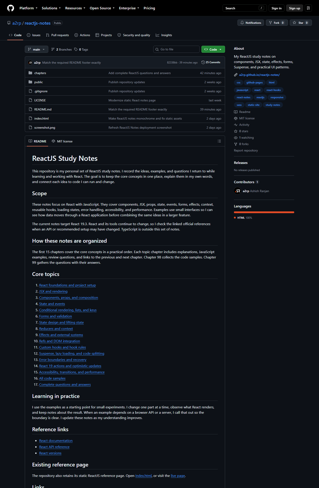

# ReactJS Notes

A compact static reference covering React components, JSX, styling, Sass, hooks, and common frontend setup notes.

## Features

- Practical ReactJS fundamentals and terminology
- JSX, components, props, styling, Sass, and hooks
- Code examples in a simple readable HTML page
- Responsive fixed header, local branding, external links, and scroll-to-top control

## Run locally

This repository is a static HTML page. Open index.html directly in a browser or serve the folder with any static web server.

## Links

- Live: [https://a2rp.github.io/reactjs-notes/](https://a2rp.github.io/reactjs-notes/)
- Repository: [https://github.com/a2rp/reactjs-notes](https://github.com/a2rp/reactjs-notes)
- Portfolio: [https://www.ashishranjan.net/](https://www.ashishranjan.net/)
- GitHub: [https://github.com/a2rp](https://github.com/a2rp)
- CodePen: [https://codepen.io/ash1198](https://codepen.io/ash1198)
- LinkedIn: [https://www.linkedin.com/in/aashishranjan](https://www.linkedin.com/in/aashishranjan)
- Facebook: [https://www.facebook.com/theash.ashish/](https://www.facebook.com/theash.ashish/)
- YouTube: [https://www.youtube.com/@ashishranjan-ashz?sub_confirmation=1](https://www.youtube.com/@ashishranjan-ashz?sub_confirmation=1)
- Email: [ash.ranjan09@gmail.com](mailto:ash.ranjan09@gmail.com)

## Support

- [Support](https://a2rp-donation-page.netlify.app/)
- [Buy Me a Coffee](https://buymeacoffee.com/a2rp)
- [Patreon](https://patreon.com/a2rp)
